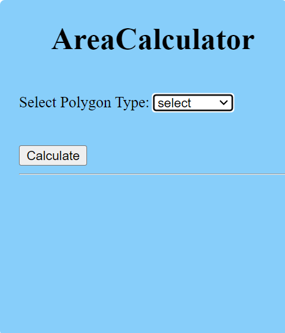
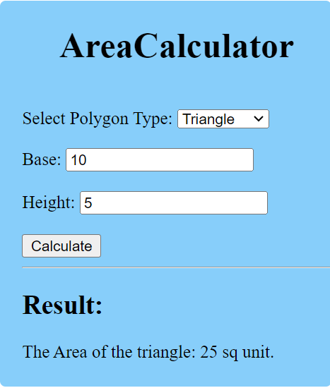
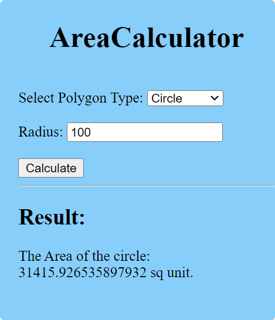

# Express Area Calculator

This project is a simple area calculator built with Express.js, designed for learning purposes. The calculator allows users to calculate the area of different geometric shapes by selecting the polygon type (e.g., triangle, rectangle, circle) and providing the necessary input parameters. The calculation is performed on the server side, and the result is displayed on the client side.

   
   
  

## Features

- **Polygon Selection**: Users can choose from various polygon types, including triangle, rectangle, circle, and more.

- **Dynamic Input Forms**: The application dynamically generates input forms based on the selected polygon type, ensuring that users provide the required parameters for accurate area calculation.

- **Server-side Calculation**: The area calculation logic is implemented on the server side using Express.js, promoting a separation of concerns and maintaining a clean and organized code structure.

- **Responsive Client-side Display**: The calculated area is displayed in real-time on the client side, providing users with immediate feedback.

## Technologies Used

- **Express.js**: The server-side framework for building the web application.

- **HTML and CSS**: The front-end components are built with HTML and styled with CSS for a clean and user-friendly interface.

- **JavaScript**: Client-side interactivity and dynamic form generation are implemented using JavaScript.

## Getting Started

1. Clone the repository: `git clone https://github.com/your-username/express-area-calculator.git`

2. Install dependencies: `npm install`

3. Run the application: `npm start`

4. Open your web browser and navigate to `http://localhost:3003` to access the area calculator.

## Contributing

Contributions are welcome! If you find any issues or have suggestions for improvements, feel free to open an issue or submit a pull request.

## License

This project is licensed under the MIT License - see the [LICENSE](LICENSE) file for details.

## Acknowledgments

- This project was created as part of a learning journey into Express.js and web development.
